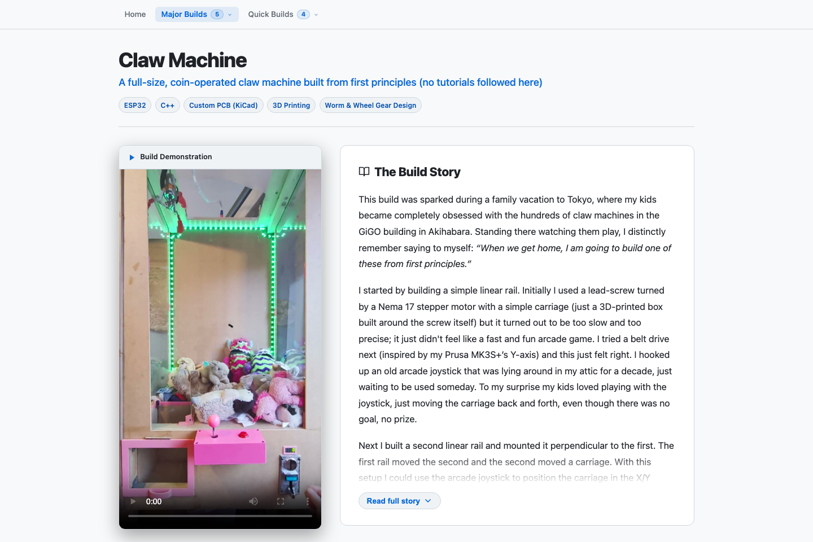
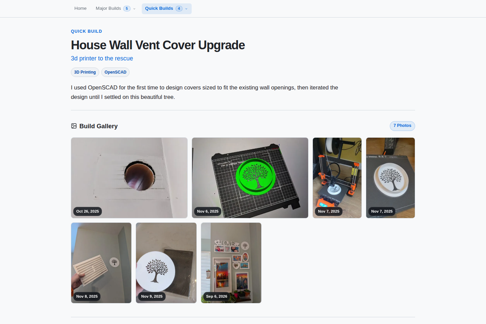
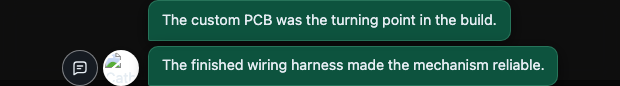

# Cathal Coffey Portfolio

This repository contains the source content and custom static site generator for [cathalcoffey.com](https://cathalcoffey.com). 

<div align="center">
  
  
</div>

## ✨ Features

- **Blazing Fast Static Generation:** A custom Python pipeline compiles templates, JSON metadata, and media into a highly optimized, dependency-free static site.
- **Media Optimization:** A Git pre-commit hook automatically strips EXIF data, resizes large images, and re-encodes videos for the web.
- **Immersive Gallery:** A responsive full-screen media viewer with deep-linking, touch support, and keyboard navigation.
- **Project Portfolios:** Beautifully crafted pages for your work.
  - **Major Builds:** Detailed write-ups featuring a massive Hero Video, engineering highlights, and a story narrative.
  - **Quick Builds:** Lightweight photo-grid galleries for smaller projects.
  - **Cover Art Selection:** Explicitly choose which image acts as the cover thumbnail for each project on the home page.

<table align="center" width="100%">
  <tr>
    <td align="center" width="50%"><strong>Major Builds (with Hero Video)</strong></td>
    <td align="center" width="50%"><strong>Quick Builds</strong></td>
  </tr>
  <tr>
    <td align="center"></td>
    <td align="center"></td>
  </tr>
</table>

- **Inline Comments:** 
  - **In-Prod (Reader Mode):** Visitors can view context-rich comments tied to specific photos or videos in the gallery.
  - **Local Authoring Mode:** When running the local development server, you can add, edit, or delete comments directly from the gallery UI. Changes are automatically saved back to the underlying `build.json` files!

<table align="center" width="100%">
  <tr>
    <td align="center" width="50%"><strong>Local Comment Authoring</strong></td>
    <td align="center" width="50%"><strong>Production Comments View</strong></td>
  </tr>
  <tr>
    <td align="center"></td>
    <td align="center"></td>
  </tr>
</table>

---

## 🚀 Getting Up and Running

### 1. Initial Setup

Install the required system dependencies (like FFmpeg for video processing), Python packages, and enable the Git hooks.

```bash
# Install FFmpeg (macOS example)
brew install ffmpeg

# Install Python dependencies
python3 -m pip install -r requirements.txt

# Enable the repository's tracked Git hooks
git config core.hooksPath .githooks
```
> **Note**: The hook setting is local to this clone. Run the `git config` command again if you clone the repository onto another computer.

### 2. Local Development Server (Recommended)

To start a watched preview that automatically rebuilds when source files (HTML, CSS, JS, JSON) change, run:

```bash
python3 dev_server.py
```
Open [http://127.0.0.1:8000/](http://127.0.0.1:8000/). 

**Authoring Comments:** When accessed via this dev server, the gallery includes the **Local Comment Authoring** feature. Click a comment bubble to edit it in place, type into the always-ready *Write a comment…* bubble, or click the `×` to delete it. Changes save directly to your local JSON metadata and trigger a rebuild. 

*(These authoring endpoints do not exist on the deployed production site).*

### 3. Manual Build & Preview

If you just want to build and serve an isolated copy without file watching:

```bash
python3 scripts/build_site.py --output _site
python3 -m http.server 8000 --directory _site
```
The `_site/` directory is disposable and ignored by Git. 

> **Warning**: The VS Code tasks provide the same isolated build and preview workflow. Do not run `generate_site.py` directly from the repository root: that generator is intended to run inside the isolated build and can rewrite source media in place.

---

## 📸 Project Configuration & Content

All content and template files live in the `src/` directory.

1. Copy your media into the relevant project directory under `src/major-builds/` or `src/quick-builds/`. 
   *(Do not create or edit a `thumbs/` directory—the pipeline handles thumbnails automatically).*
2. Supported formats: `.jpg`, `.jpeg`, `.png`, `.webp`, `.mp4`, `.mov`, `.webm`.
3. Stage and commit:
   ```bash
   git add src/major-builds/claw-machine
   git commit -m "Add claw machine media"
   ```

Before the commit is created, the `.githooks/pre-commit` hook automatically optimizes newly staged media (resizes images, strips EXIF, re-encodes video) and re-stages it.

### The `build.json` File

Each project is defined by a `build.json` (or `project.json`) file in its directory. The static site generator reads this file to build the project page.

Key configurations you can define:

- `title` & `subtitle`: The headline text for the project.
- `hero_video`: The filename of the video to play at the top of the project page. If omitted, the pipeline defaults to the first video found in the directory.
- `cover_image` (or `cover_img`): The filename of the image to use as the project's thumbnail on the homepage and for OpenGraph tags. If omitted, defaults to the last chronological photo in the folder.
- `story`: HTML content for the main narrative of a major build.
- `engineering_highlights`: A list of technical bullet points for major builds.
- `next_steps`: A list of future plans or iterations for the project.

### Manual Comment Configuration

While you can author comments directly in the browser via `dev_server.py`, you can also manually define them under the `media_descriptions` key in `build.json`:

```json
{
  "title": "Claw Machine",
  "hero_video": "demo-reel.mp4",
  "cover_image": "final-machine.jpg",
  "media_descriptions": {
    "PXL_20260226_150354165.jpg": [
      "The early control system was spread across several breadboards before the custom PCB brought everything together."
    ],
    "demo.mp4": "The first successful end-to-end test."
  }
}
```
A speech-bubble marker on a thumbnail indicates that comments are available for that item.

---

## 🍴 Forking This Project

If you'd like to use this static site generator for your own portfolio, it is designed to be easily forkable!

1. **Fork the repository** on GitHub.
2. **Personalize your details:** Edit `src/site.json` and replace the name, job title, bio, and social links with your own.
3. **Change the avatar:** Replace `src/favicon.ico` with your own image or logo.
4. **Add your content:** Delete the existing projects in `src/major-builds/` and `src/quick-builds/`, and add your own folders containing your media and `build.json` files.
5. **Commit and push** to your `master` branch. GitHub Actions will automatically generate and deploy your personalized portfolio!

---

## 🧪 Testing and Linting

The repository includes a comprehensive browser regression suite that runs in headless Chromium (just like in CI).

### Browser Regression Tests
```bash
python3 -m pip install -r requirements-test.txt
python3 -m playwright install chromium
SITE_ROOT=_site python3 scripts/test_browser.py
```
If you make an intentional visual change, you can update the visual baselines by running:
```bash
SITE_ROOT=_site python3 scripts/test_browser.py --update-snapshots
```

### Linting
**Python:**
```bash
python3 -m pip install -r requirements-test.txt
python3 -m ruff check .
```
**HTML / CSS / JS:**
```bash
npm ci
npm run lint:js
npm run lint:css
python3 scripts/build_site.py --output _site
npm run lint:html
```

---

## 🏗️ Architecture & Responsibilities

- **Source Repository:** Project JSON, templates, CSS, JavaScript, and source media.
- **Pre-commit Hook:** Optimizes only newly staged source images and videos.
- **Generated `_site/`:** Temporary local or CI output; **never commit it**.
- **GitHub Actions:** Generates thumbnails/posters, extracts robots.txt/sitemap, runs tests, and deploys the complete static site to GitHub Pages.
